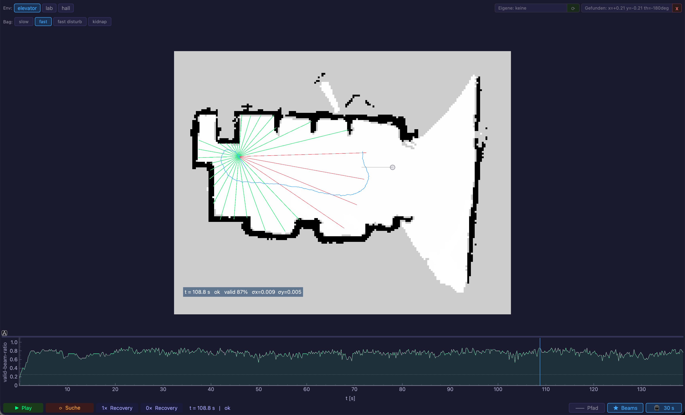
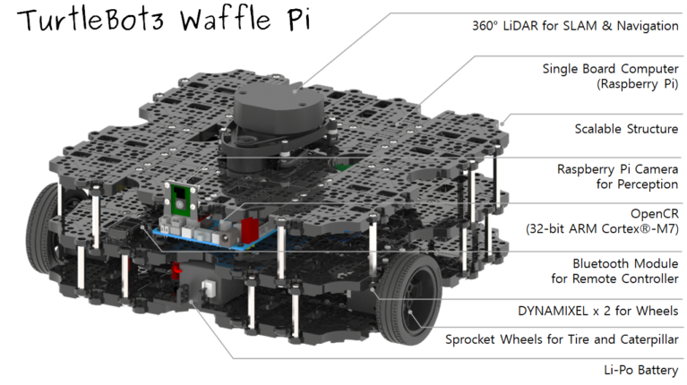

# Extended Kalman Filter Localization

Runtime EKF localization and recovery experiments for a TurtleBot3-style mobile robot. The repository contains a cached PyQt player for immediate inspection, the causal runtime simulator used to generate the cache, and a ROS2 node that can run the EKF live on a Linux robot setup.



## What is included

```text
docs/                 Paper PDF
runtime/player.py     PyQt player for cached EKF runs
runtime/simulator.py  Causal runtime simulator for ROS2 bags
runtime/config.py     Shared runtime parameters
runtime/cache/        Precomputed runtime results for the player
robot/ekf_live.py     ROS2 live EKF node
robot/start_poses.json
maps/                 Occupancy-grid maps used by the cache and live node
assets/               README images
```

Raw ROS2 bags are not committed. The player works without them because `runtime/cache/` already contains precomputed EKF results. Recomputing a run requires the corresponding ROS2 bag directories under `bags/`.

## Quick Start: Cached Player

Use this path when you only want to inspect the EKF behavior.

```bash
python3 -m venv .venv
source .venv/bin/activate
python3 -m pip install -r requirements.txt
python3 runtime/player.py
```

The player opens with the cached scenarios for `elevator`, `lab`, and `hall`. Select an environment and a bag label such as `fast`, `slow`, `fast disturb`, or `kidnap`. If a cache file exists, the run loads immediately.

The cache contains:

```text
runtime/cache/*_runtime.npz   Numeric arrays: poses, covariance, scans, modes
runtime/cache/*_runtime.json  Metadata: events, mode names, configuration
runtime/cache/start_poses.json
```

## Recompute From ROS2 Bags

Recompute is optional and needs raw ROS2 bags, which are intentionally not part of Git. Place trimmed bags in this layout:

```text
bags/
  elevator/
    elevator_slow/
    elevator_fast/
    elevator_disturbance/
    elevator_kidnap_slow/
  lab/
    rosbag2_lab_slow/
    rosbag2_lab_fast/
    rosbag2_lab_fast_disturb/
    rosbag2_lab_fast_kidnap/
  hall/
    rosbag2_hall_slow/
    rosbag2_hall_fast/
    rosbag2_hall_fast_disturb/
```

Then run either through the GUI with `Recompute`, or from the command line:

```bash
python3 runtime/simulator.py bags/lab/rosbag2_lab_fast maps/lab/map.yaml
python3 runtime/player.py
```

The simulator processes `/odom` and `/scan` in timestamp order. Each scan is paired with the latest odometry message whose header timestamp is less than or equal to the scan timestamp. Search and recovery durations are mapped into virtual robot time, so the replay remains causal while running faster than real time.

## Live ROS2 Node



`robot/ekf_live.py` is the runtime EKF node for a live ROS2 setup. It subscribes to:

```text
/odom
/scan
/initialpose
```

It publishes:

```text
/map
/ekf/pose
/ekf/path
/ekf/beams
/ekf/mode
map -> odom TF
```

Example on a ROS2 Humble machine:

```bash
source /opt/ros/humble/setup.bash
python3 robot/ekf_live.py maps/lab/map.yaml \
  --bag-id bags/lab/rosbag2_lab_fast \
  --run-root /tmp/ekf_runs
```

The node records each run under `--run-root`. Copy or archive that directory manually if you want to keep the recorded results elsewhere.

## Dataset Policy

The repository intentionally tracks only small, reproducible artifacts:

```text
tracked:   code, maps, cached results, documentation images, paper PDF
ignored:   raw ROS2 bags, generated runs, logs, sweep results
```

For a public release, upload the raw bags separately, for example as a GitHub Release asset or Zenodo archive, and keep the `bags/` layout above.

## Image Credits

The TurtleBot3 image in `assets/turtlebot.png` is from ROBOTIS' TurtleBot3 product page: https://robotis.us/turtlebot-3/
